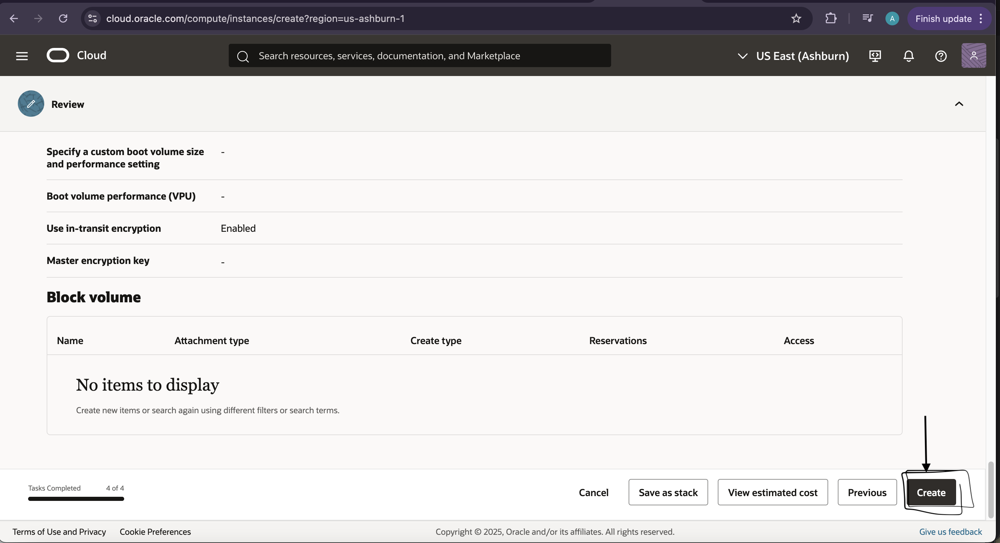
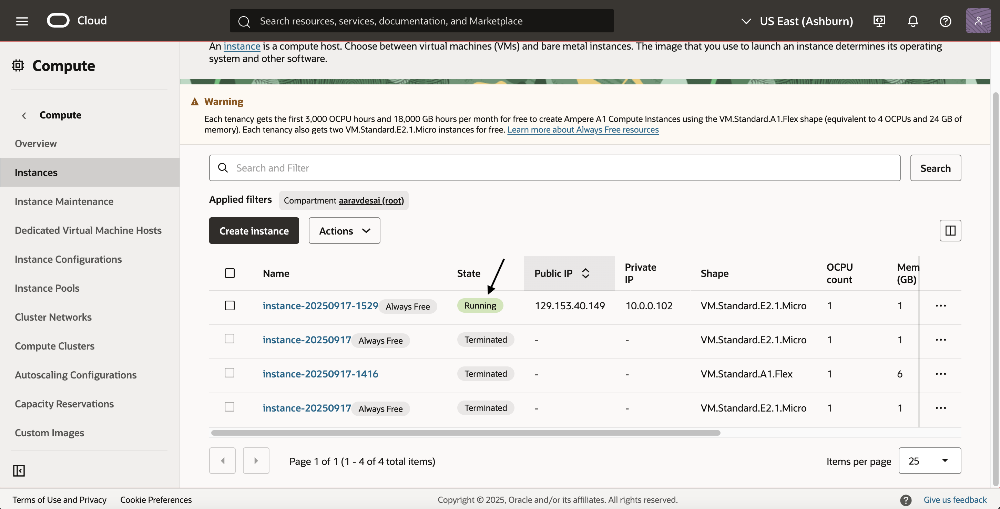

# VM Lifecycle on GCP and OCI — Tutorial

## Video
Loom for Oracle: <[paste link](https://www.loom.com/share/672718a4976848e489915177dad642a4?sid=a22cc99b-40eb-4029-ac9e-bcbcb0c0c702)>

Loon for Google Cloud 

## Prereqs
- Cloud access to GCP and OCI
- No PHI/PII; smallest/free-tier shapes

---

## Google Cloud (GCP)
### Create
1. Console → Compute Engine → Create instance
2. Region/zone: <your choice>
3. Machine type: <smallest available/free-eligible>
4. Image: Ubuntu LTS
5. Boot disk: default minimal
6. Network: default VPC; ephemeral public IP

### Start/Stop
- Start: <state shows RUNNING>
- Stop: <state shows TERMINATED/STOPPED>

### Delete
- Delete instance and verify no disks/IPs remain

---

## Oracle Cloud (OCI)
### Create
1. Compartment: <name>
2. Networking: VCN with Internet Connectivity (defaults)
3. Shape: <smallest/free-eligible>
4. Image: Ubuntu (or Oracle Linux)
5. Public IP: ephemeral
6. Boot volume: default minimal

### Start/Stop
- Start: <state shows RUNNING>
- Stop: <state shows STOPPED>

### Terminate
- Terminate and delete boot volume; verify cleanup

---

## Reflections
### Similarities
- <brief bullets>

### Differences
- <brief bullets>

### Preference (OCI vs GCP) and Why
- <one short paragraph>