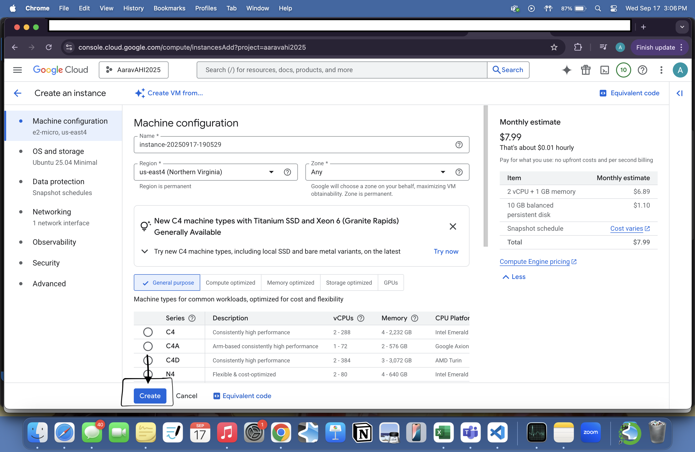
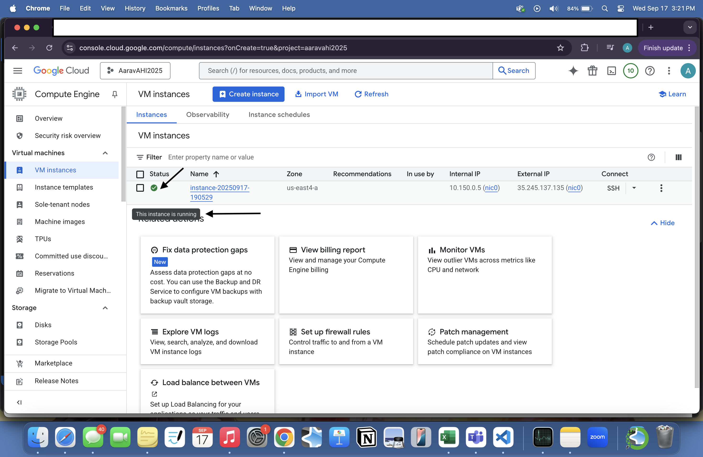
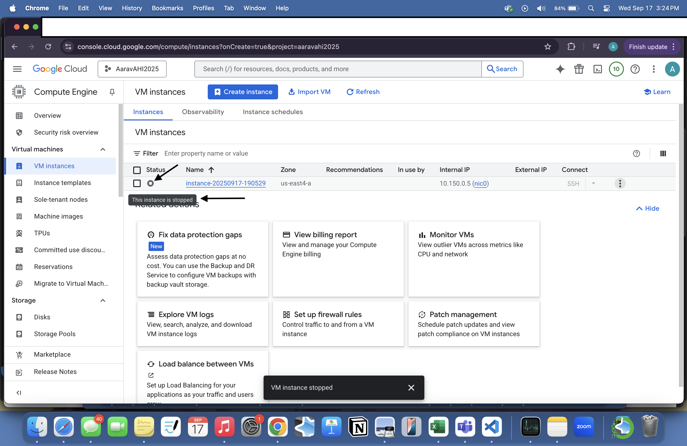
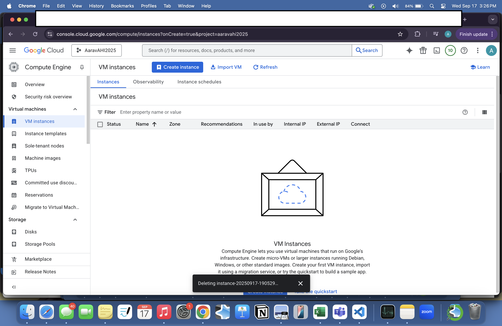
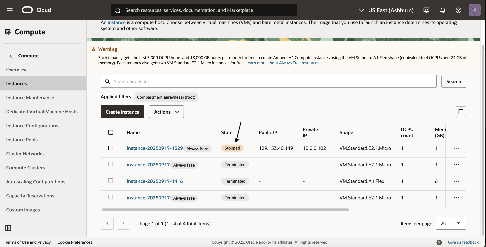
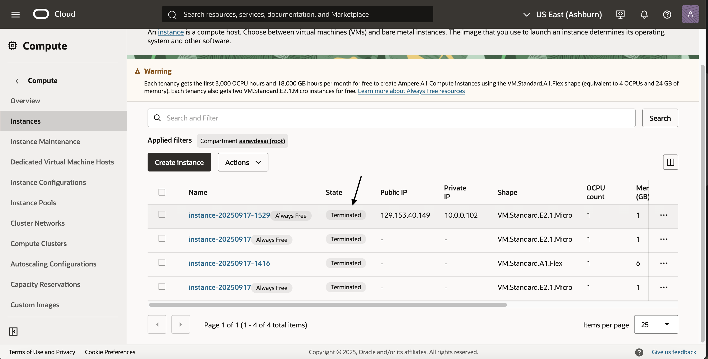

# VM Lifecycle on GCP and OCI — Tutorial

## Video
Loom for Oracle: <[Oracle](https://www.loom.com/share/672718a4976848e489915177dad642a4?sid=a22cc99b-40eb-4029-ac9e-bcbcb0c0c702)>

Loom for Google Cloud: <[Google Cloud](https://www.loom.com/share/a8c8fb52462748e8b4a154b66217c46d?sid=ed58b8b3-cd6f-412e-88e7-f4a7914db586)>

## Prereqs
- Cloud access to GCP and OCI
- No PHI/PII; smallest/free-tier shapes

---

## Google Cloud (GCP)
### Create
1. Console → Compute Engine → Create instance
2. Region/zone: <East(Northern Virgina)>
3. Machine type: <e2-micro>
4. Image: Ubuntu LTS
5. Boot disk: default minimal
6. Network: default VPC; ephemeral public IP

### Create

### Start/Stop

### Delete
- Delete instance and verify no disks/IPs remain

---

## Oracle Cloud (OCI)
### Create
1. Compartment: <aaravdesai (root)>
2. Networking: VCN with Internet Connectivity (defaults)
3. Shape: <sVM.Standard.E2.1.Micro>
4. Image:  Oracle Linux
5. Public IP: ephemeral
6. Boot volume: default minimal

### Create

### Start/Stop

### Terminate
- Terminate and delete boot volume; verify cleanup

---

## Reflections
### Similarities
- both have SaaS
- both offer virtual private cloud networks
- both have data centers across regions
- both have block, object, and file storage available 

### Differences
- Oracle is cheaper at $2 a month vs Google at $8 a month
- Oracle is strong in enterprise workloads, Google is stronger in analytics
- Oracle is known for bare metal servers, Google is known for custom machine type

### Preference (OCI vs GCP) and Why
- I prefer OCI. OCI offers bare-metal performance, predictable low  pricing, and deep integration with Oracle Database. Unlike Google, OCI was built with enterprise workloads in mind, making it reliable for running applications at scale. OCI is also easier for a newcomer to understand. 